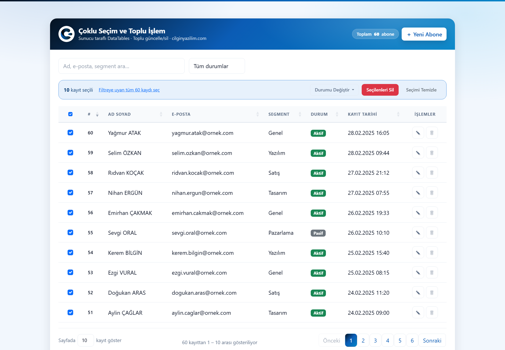
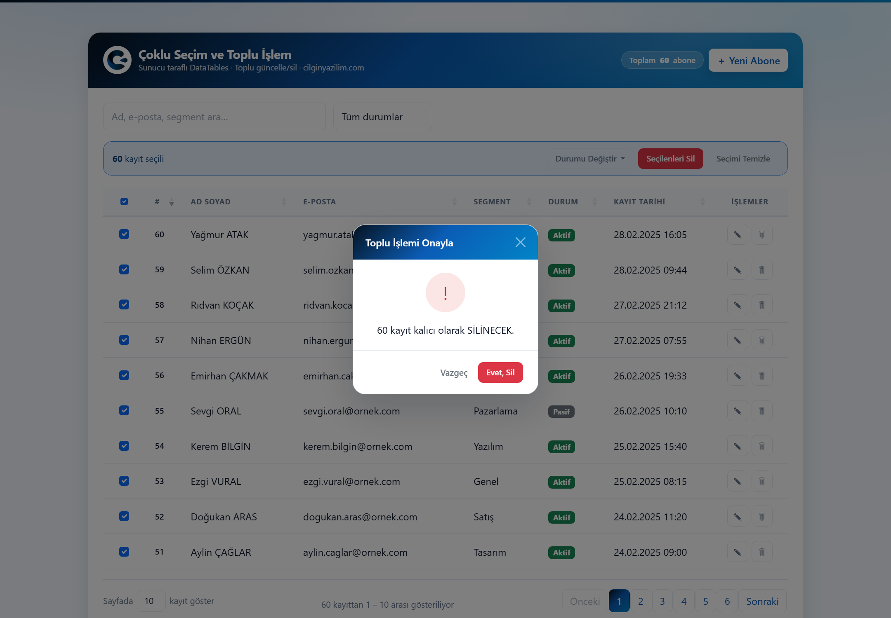
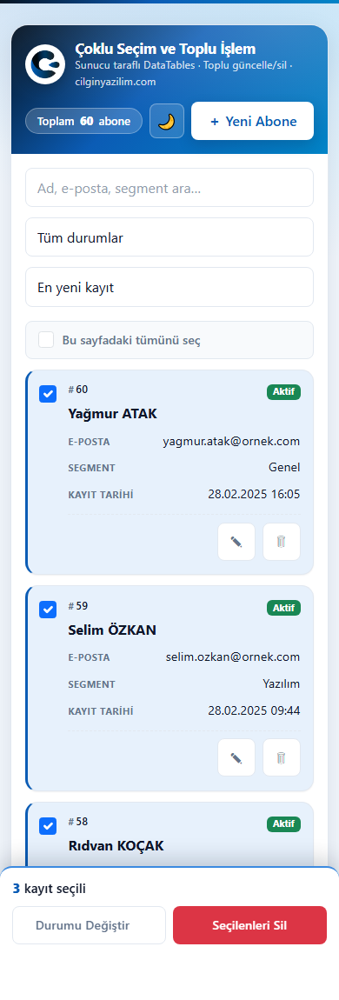
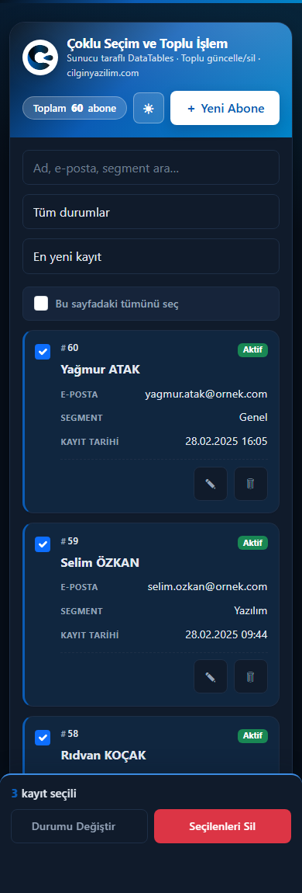

<div align="center">


# Çoklu Seçim ve Toplu İşlem Tablosu

**Sunucu taraflı DataTables üzerinde çoklu seçim ve toplu işlem.**
Seçili kayıtlar · Filtreye uyan TÜMÜ · Gerçek sayıyla onay · Onaylanan sayı denetimi

[](https://github.com/CilginYazilim/bulk-actions-table/releases)
[](https://www.php.net/)
[](https://www.mysql.com/)
[](LICENSE)

[cilginyazilim.com](https://cilginyazilim.com) &nbsp;·&nbsp; [Örnek Kodlar & Kütüphane](https://cilginyazilim.com/kutuphane) &nbsp;·&nbsp; [Bu örneğin anlatımı](https://cilginyazilim.com/kutuphane/toplu-islem-tablosu)

**Türkçe** | [English](README.en.md)

</div>

---

<div align="center">



<sub>Bu sayfadaki 10 satır işaretlendi. Çubuk belirdi ve <b>“Filtreye uyan tüm 60 kaydı seç”</b> bağlantısı çıktı —<br>seçimin ikinci anlamına geçiş buradan yapılır.</sub>

</div>

---

## Bu proje ne yapıyor?

Bir bülten abone listesi üzerinde satırları işaretleyip **toplu durum değiştirme** ve **toplu silme** yapabilirsiniz. Ama asıl anlattığı şey bir arayüz hilesi değil:

> Sunucu taraflı bir tabloda **“seçili” kelimesinin iki farklı anlamı vardır** ve bu iki anlamı birbirine karıştıran kod, kullanıcının onayladığından fazlasını siler.

Proje bu ayrımı kurar, iki anlamı tek bir doğru yoldan geçirir ve aradaki her boşluğu ölçüp kapatır.

---

## “Seçili”nin iki hâli

| Mod | Ne zaman oluşur | Sunucuya ne gider |
|-----|-----------------|--------------------|
| **Belirli kayıtlar** (`scope=selected`) | Kullanıcı birkaç satırı tek tek işaretler | `ids[]` — açık id listesi |
| **Filtreye uyan TÜMÜ** (`scope=filtered`) | Kullanıcı bu sayfadaki herkesi işaretler, sonra “Filtreye uyan tüm N kaydı seç” bağlantısına tıklar | Arama + durum filtresi — **id listesi YOK** |

### Neden ikinci moda ihtiyaç var? — Gmail benzetmesi

Sunucu taraflı bir DataTables’ta kullanıcı **asla tüm satırları aynı anda görmez**; yalnızca o anki sayfayı görür. 50.000 kayıtlık bir listede “tümünü seç” dendiğinde 50.000 id’yi tarayıcıya indirip sonra sunucuya geri göndermek hem yavaştır hem anlamsızdır.

Gmail’de bir arama yaptığınızda üstteki kutucuğu işaretlersiniz ve şu çıkar: *“Bu sayfadaki 50 konuşmanın tümü seçildi — **bu aramaya uyan 4.312 konuşmanın tümünü seç**.”* İkinci bağlantıya bastığınızda Gmail size 4.312 kimlik göndermez; sunucuya **“aynı arama koşulunu tekrar uygula, eşleşen herkese bu işlemi yap”** der.

Bu proje tam olarak aynı deseni kurar:

```
resolve_bulk_scope()                             (system/ajax.php)
   scope=selected  →  WHERE id IN (:id0, :id1, :id2, …)
   scope=filtered  →  WHERE (name LIKE :s_name OR email LIKE :s_email
                             OR segment LIKE :s_segment) AND status = :status
```

### Kritik nokta: koşul TEK YERDE üretilir

`scope=filtered` koşulu, ekrandaki listeyi üreten koşulla **birebir aynı fonksiyondan** gelir: [`subscriber_filter()`](system/function.php).

Bu koşul eskiden üç ayrı yerde (listeleme, sayaç, toplu işlem) kopyalanmıştı. Biri güncellenip diğeri unutulduğunda ortaya çıkacak hata sessizdir ve yıkıcıdır: kullanıcı ekranda 12 kişi görür, “tümünü seç” der, toplu işlem 15 kişiyi siler. Bu yüzden kopyanın kaldırılması burada bir temizlik değil, doğrudan bir **güvenlik önlemidir**.

---

## Yanlışlıkla silmeye karşı iki ayrı fren

<div align="center">



<sub><b>“Emin misiniz?”</b> değil, <b>“60 kayıt kalıcı olarak SİLİNECEK.”</b></sub>

</div>

### 1. Fren — Gerçek sayıyla onay (`bulk_preview`)

Toplu işlem tetiklendiğinde önce `bulk_preview` uç noktasına gidilir. Sayı, işlemi yapacak olan **`resolve_bulk_scope()`’un ta kendisinden** gelir; önizlemenin ayrı bir hesap yolu olsaydı gösterdiği sayı bir süsten ibaret kalırdı.

Sayı her zaman **veritabanından sayılır**. Eskiden seçili kapsamda istemcinin gönderdiği id adedi döndürülüyordu; var olmayan 10 id gönderildiğinde pencere “10 kayıt SİLİNECEK” diyor, gerçekte 0 kayıt siliniyordu. Onay penceresinin tek varlık sebebi gerçeği göstermek olduğuna göre, o sayının kaynağı istemci olamaz.

### 2. Fren — Onaylanan sayı denetimi (`expected_count`)

Önizleme ile onay arasında geçen sürede liste değişebilir. Ölçülen senaryo: kullanıcı **8 kayıt** için onay verdi, başka bir sekme araya bir kayıt ekledi, silme **9 kaydı** götürdü.

Artık istemci, onay penceresinde **gördüğü sayıyı** işlem isteğiyle birlikte geri gönderir (`expected_count`). Sunucu kendi saydığı sayıyla karşılaştırır:

```
expected_count eksik              → 422, işlem yapılmaz
expected_count ≠ gerçek sayı      → 409, işlem yapılmaz, güncel sayı döner
yazma sırasında sayı kayarsa      → transaction geri alınır (rollback), 409
```

Arayüz 409’u bir hata olarak değil, bir fren olarak karşılar: listeyi tazeler ve onayı **güncel sayıyla** yeniden sorar.

> **“8 kayıt silinecek” onayı, 9 kaydı silmeye yetki vermez.** Bu cümle projenin tamamının özetidir.

---

## Mobil: tablo, telefonda tablo olmamalı

Sekiz sütunlu bir tablo telefona sığmaz. Yaygın çözüm `overflow-x: auto` ile **yatay kaydırmadır** — ve bu projede de öyleydi. Teknik olarak çalışıyordu; pratikte kullanılamıyordu:

> Kullanıcı ad-soyadı görürken durumu ve işlem düğmelerini göremiyordu. Seçim kutucuğu ile “Sil” düğmesi arasında **iki kere sağa-sola kaydırmak** gerekiyordu.

Toplu işlemin ön koşulu **satırı tanıyabilmektir**. Hangi kaydı işaretlediğini görmeden onay veren bir kullanıcı, aslında onay vermiş sayılmaz. Yatay kaydırma bunu imkânsızlaştırıyordu.

### Çözüm: aynı HTML, iki yerleşim

`< 768px` altında her `<tr>` bir **karta** dönüşür. Sunucu tarafında “mobil mi?” diye bir karar **verilmez** — tek bir HTML çıktısı iki yerleşimi de besler:

| Masaüstü | Mobil |
|----------|-------|
| `<thead>` sütun başlıkları | Gizlenir; her hücrenin başlığı `data-label` ile hücrenin üstüne yazılır |
| Ad Soyad bir hücre | Kartın **başlığı** (kalın, büyük) |
| Durum rozeti bir hücre | Kartın **sağ üst köşesi** |
| Kutucuk ilk sütun | Kartın **sol üst köşesi**, 44px’lik dokunma alanı içinde |
| İşlem düğmeleri son sütun | Kartın **altında**, kesikli ayırıcının ardında, 44×44px |
| Başlığa tıklayarak sıralama | Araç çubuğundaki **sıralama listesi** (`#mobile_sort`) |
| Başlıktaki “tümünü seç” kutucuğu | Tablonun üstünde **tam genişlikte etiketli satır** |

Etiketleri `table.js` içindeki `rowCallback` ekler; yerleşimi tamamen CSS kurar. PHP tarafında **tek satır** değişiklik gerekmedi.

<div align="center">


&nbsp;&nbsp;


<sub>390px genişlikte. Üç kart <b>Shift + tık</b> ile aralık olarak seçildi; seçili kartlar sol kenarındaki mavi şeritten belli oluyor<br>ve toplu işlem çubuğu ekranın altına sabitlenmiş durumda. Sağdaki aynı ekranın koyu tema hâli.</sub>

</div>

### Toplu işlem çubuğu ekranın altına sabitlendi

Çubuk akış içinde, tablonun **üstündeydi**. Telefonda kullanıcı listeyi aşağı kaydırıp 12. satırı işaretlediğinde çubuk ekranın çok yukarısında kalıyordu.

> **Seçim yaparken ekranda görünmeyen bir eylem çubuğu, olmayan bir eylem çubuğuyla aynı şeydir.**

Mobilde çubuk artık `position: fixed` ile ekranın altına — başparmağın doğal olarak durduğu yere — sabitlenir. Üç eylem ızgaraya dizilir (“Durumu Değiştir” + “Seçilenleri Sil” yan yana, “Seçimi Temizle” tam genişlik), hepsi en az 44px yüksekliğindedir. Sayfanın son satırı çubuğun altında kalmasın diye `<body>`’ye seçim varken alt boşluk eklenir (`body.cy-bulk-active`), çentikli telefonlar için `env(safe-area-inset-bottom)` hesaba katılır.

Bildirimler (toast) bilerek **üstte** bırakıldı: iki sabit öge alt kenarda çakışırdı.

### Diğer mobil düzeltmeler

| Sorun | Neden önemliydi | Çözüm |
|-------|-----------------|-------|
| Araç çubuğu `flex-wrap: nowrap` + yatay kaydırma | Arama kutusu ve durum listesi kullanılamayacak kadar daralıyor, kullanıcıdan fark etmesi en zor etkileşim (yatay kaydırma) bekleniyordu | Dar ekranda alt alta, her biri tam genişlik |
| Form alanları `< 16px` | iOS Safari odaklanınca sayfayı **otomatik yakınlaştırıyor**, kullanıcı formu doldurduktan sonra elle uzaklaştırmak zorunda kalıyordu | Modal içindeki `input`/`select` mobilde `16px` |
| İkon düğmeleri 32px | Parmakla ıskalanıyordu; yanlış satırın “Sil” düğmesine basmak geri dönüşsüz | 44×44px |
| Sayfalama düğmeleri küçük | Aynı sorun, en sık dokunulan yerde | `min-width/height: 42px`, alt çubuk mobilde **sayfalama → bilgi → uzunluk** sırasına geçer |
| Küçük modal (`modal-sm`) dar ekranda daha da daralıyordu | Onay metni iki satıra bölünüyordu | Mobilde `max-width` kaldırıldı, düğmeler tam genişlik |

---

## Arayüz geliştirmeleri (v1.1.0)

**Shift + tık ile aralık seçimi.** 40 satırlık bir sayfada 30 satırı tek tek işaretlemek kullanıcıyı yorar ve yanlış tıklamaya davet eder. Aralık, **ekrandaki sıraya** göre hesaplanır (`lastPageIds`). Olay `change` yerine `click` dinlenir — `change` olayı `shiftKey` bilgisini taşımaz.

**Seçili satır artık görünüyor.** Masaüstünde ince bir zemin rengi, mobil kartta sol kenarda marka mavisi bir şerit (`.cy-row-selected`). Kutucuğa bakmadan da hangi kartların seçili olduğu anlaşılır.

**`Esc` seçimi bırakır.** Toplu işlem modundan çıkmanın en hızlı yolu. Bir modal açıkken `Esc` Bootstrap’e bırakılır; iki davranışın çakışması “pencereyi kapatmak istedim, seçimim de gitti” şaşkınlığına yol açardı.

**Açık / koyu tema düğmesi.** Tasarım sistemi (`cilginyazilim.css`) zaten iki yoldan koyu temayı destekliyordu: `prefers-color-scheme` (işletim sistemi) ve `<html data-cy-theme="dark">` (kullanıcı). Düğme yalnızca ikincisini yazar ve `localStorage`’a kaydeder; hiç dokunulmazsa karar işletim sistemine kalır. Tercih, sayfa çizilmeden **`<head>` içindeki satır içi betikle** uygulanır — sonradan uygulansaydı koyu temada bir kare boyunca beyaz ekran görünürdü (FOUC).

**ÖLÇÜLEN SORUN — “Seçimi Temizle” yarım çalışıyordu.** İç durumu (`selectedIds`) boşaltıyor ve çubuğu gizliyordu, ama **ekrandaki kutucuklar işaretli kalıyordu**: seçim temizlendikten sonra tablo hâlâ “10 satır seçili” gibi görünüyordu. `resetSelection()` artık kutucukları da eşitliyor (`syncPageCheckboxes()`).

---

## Ölçülen ve kapatılan sorunlar

Aşağıdakilerin hepsi çalışan kurulumda HTTP üzerinden **ölçüldü**, düzeltildi ve **yeniden ölçüldü**.

| # | Sorun | Önce | Sonra |
|---|-------|------|-------|
| 1 | `scope=filtered` ile toplu durum değiştirme, filtre aktifken **her zaman** çöküyordu (isimli ve konumsal parametre karışması) | `HTTP 500` · `SQLSTATE[HY093]` | `HTTP 200` · doğru kayıtlar güncellendi |
| 2 | Aynı hatalı bağlama biçimi silmede **sessizce çalışıyordu** — bozuk kod bir uç noktada patlıyor, diğerinde veri siliyordu | `200` · 57 kayıt silindi | Her ikisi de tek `execute_bulk()` yolundan geçiyor |
| 3 | Önizleme sayısı seçili kapsamda **istemciden** geliyordu | 10 sahte id → “10 kayıt silinecek”, gerçekte 0 | Sayı veritabanından: `count 0` |
| 4 | Bayat önizleme: onaylanandan fazlası siliniyordu | 8 onaylandı → **9 silindi** | `HTTP 409`, hiçbir şey silinmedi |
| 5 | CSRF reddi 419 dönüyordu; Apache bunu sessizce 500’e çeviriyor | `HTTP 500` | `HTTP 403` |
| 6 | `action=list` CSRF anahtarı **istemiyordu** — anahtarsız istek 60 abonenin tamamını (ad, e-posta) döndürüyordu | `HTTP 200` · 60 kayıt | `HTTP 403` |
| 7 | Geçersiz durum filtresi **sessizce yok sayılıyor**, kapsam tüm tabloya genişliyordu | `status_filter=uydurma` → `count 60` | `HTTP 422` |
| 8 | `system/` klasörü web’den açıktı; `config.php` her istekte veritabanı bağlantısı açıyordu | `/system/config.php` → `200` | `403` (`.htaccess` + `CY_APP`) |
| 9 | Sıralanan sütunlarda indeks yoktu | `ORDER BY name`, 123.000 kayıt → **355 ms** (`Using filesort`) | **1 ms** (`Using index`) |
| 10 | Filtre boşken aynı `COUNT(*)` iki kez çalışıyordu | her sayfa çevirmede +175 ms | tek sorgu |

### Denenip **sorun çıkmayan** noktalar

Bunlar da ölçüldü; burada bir açık **bulunamadı** ve kod olduğu gibi bırakıldı:

- **SQL enjeksiyonu — sıralama sütunu:** İstemci sütun adı değil, bir dizi indisi gönderir; tanınmayan indis `id`’ye düşer. `order[0][column]` alanına SQL parçası gönderildi, sorgu normal çalıştı.
- **XSS:** `<script>alert(1)</script>` ve `">` yükleri kayıt olarak eklendi; listede `&lt;script&gt;` olarak kaçışlı döndü. `table.js` metinleri `.text()` ile yazar, `.html()` ile değil.
- **LIKE joker karakterleri:** Arama kutusuna `%` yazıldığında 0 sonuç döndü (`escape_like()` çalışıyor) — aksi hâlde tek karakterlik bir arama tüm tabloyu “filtreye uyan tümü” kapsamına sokardı.
- **`BULK_MAX_IDS = 500`:** 501 id gönderildi → `HTTP 422`. Sınır gerçekten uygulanıyor.
- **CSRF anahtarı oturuma bağlı:** Başka bir oturumun anahtarıyla istek `403` aldı.

### Bilinçli olarak **değiştirilmeyen** davranış

**Filtre boşken `scope=filtered` tüm tabloyu hedefler.** Ölçüm: `bulk_preview` → `count: 60` (60 kayıttan 60’ı). Bu, Gmail’in “tüm konuşmaları seç” davranışının aynısıdır ve **kaldırılmadı** — “filtreyi temizleyip hepsini seçmek” meşru bir istektir; yasaklamak kullanıcıyı 500’er kayıtlık turlara zorlardı.

Yeterli koruma olduğu kanaatine şu gerekçeyle varıldı: bu işlem artık **üç ayrı kapıdan** geçiyor. Önizleme gerçek sayıyı yazıyor (“60 kayıt kalıcı olarak SİLİNECEK”), onaylanan sayı sunucuda doğrulanıyor, ve arayüzde bu moda geçmek ayrı bir bilinçli tıklama gerektiriyor. Sayının kendisi zaten en güçlü uyarıdır: tablonun tamamı olduğunda kullanıcı bunu okuyarak görür.

### Transaction: neden var, neden tek başına gerekmezdi

`bulk_status` ve `bulk_delete` tek bir SQL ifadesi çalıştırır — **tek ifadeli DML zaten atomiktir**, bu hâliyle transaction tek başına gereksiz olurdu. Buradaki gerçek gerekçe, yazma sonrası yapılan “onaylanandan fazlasına dokundum mu?” denetimidir: sayım, yazma ve geri alma kararı ancak transaction içinde **tek bir bütün** olur. Transaction olmasaydı farkı görsek bile silinen kayıtları geri getiremezdik. ([system/ajax.php](system/ajax.php) `execute_bulk()`)

---

## Güvenlik katmanları ve her birinin **nedeni**

| Katman | Nerede | Neden orada |
|--------|--------|-------------|
| **CSRF anahtarı** (yazma **ve** okuma) | `require_csrf()` | Başka bir sitede açık bir sekmenin, kullanıcının oturumuyla toplu silme tetiklemesini engeller. Okuma için de zorunlu: `list` bir müşteri listesi döndürür, sızması tek başına zarardır. |
| **Reddin 403 dönmesi** | `require_csrf()` | 419 resmî bir kod değildir; bu Apache kurulumunda sessizce 500’e dönüşüyor ve istemci “oturumun bitmiş” yerine “sunucu çöktü” görüyordu. |
| **Hazır ifadeler, her yerde isimli** | tüm sorgular | Kullanıcı verisi asla SQL metnine girmez. Tek kural (“her yer isimli”) iki biçimin karışmasını yapısal olarak imkânsız kılar. |
| **Sıralama sütununda beyaz liste** | `handle_list()` | Sütun adı parametre olarak bağlanamaz, metin olarak SQL’e girer. İstemci sütun adı değil indis gönderir. |
| **`escape_like()`** | `subscriber_filter()` | `%` ve `_` kullanıcı için harftir, joker değil. Kaçırılmazsa tek karakterlik arama tüm tabloyu kapsar. |
| **Beyaz listeli doğrulama** | `validate_status()`, kapsam ve durum filtresi | Tanınmayan değer **reddedilir**, yok sayılmaz. Kapsamı sessizce genişleten bir hata, gürültülü bir hatadan çok daha tehlikelidir. |
| **`BULK_MAX_IDS`** | `config.php` | Binlerce id içeren istekle sunucuyu yormayı engeller; üstü zaten `scope=filtered`’in işidir. |
| **Onaylanan sayı denetimi** | `execute_bulk()` | Kullanıcının onayı belirli bir SAYI içindir. Sayı değiştiyse onay geçersizdir. |
| **Çıktı kaçışı** | `e()` | Ada `<script>` yazan bir abone, listeyi açan herkeste kod çalıştırabilirdi. |
| **`system/.htaccess` + `CY_APP`** | klasör + dosya başları | Beyaz liste: yalnızca `ajax.php` açık. Yarın eklenen dosya varsayılan olarak kapalıdır. `CY_APP`, `.htaccess` okunmayan sunucular (nginx) için ikinci katmandır. |
| **Kök `.htaccess`** | proje kökü | `.sql`/`.md` indirilemez; `nosniff`, `X-Frame-Options`, `Referrer-Policy` başlıkları eklenir. Çerçeveye alınmış bir tabloda kullanıcıya farkında olmadan “Seçilenleri Sil” tıklatılabilir. |

---

## Kurulum

```bash
cd C:/xampp/htdocs
git clone https://github.com/CilginYazilim/bulk-actions-table.git

mysql -u root -p < bulk-actions-table/cy_bulk.sql
```

Tarayıcıdan: **http://localhost/bulk-actions-table/**

> **Canlıya alırken** `system/config.php` içindeki `APP_DEBUG` değerini `false` yapın — açık kaldığında veritabanı hata metinleri istemciye gider.

**Gereksinimler:** PHP 8.0+ (PDO MySQL), MySQL 5.7+ / MariaDB 10.3+, Apache (`mod_headers` önerilir). Harici bağımlılık yoktur; jQuery, Bootstrap ve DataTables depoda gelir.

---

## Dosya yapısı

```
bulk-actions-table/
├── index.php                  ← Arayüz: tablo, toplu işlem çubuğu, üç modal, tema betiği
├── cy_bulk.sql                ← Veritabanı kurulumu (cy_bulk, 60 örnek abone)
├── .htaccess                  ← Dizin listeleme kapalı, .sql/.md engelli, güvenlik başlıkları
├── system/
│   ├── .htaccess              ← Beyaz liste: yalnızca ajax.php dışarı açık
│   ├── config.php             ← Ayarlar, durum tanımları, PDO bağlantısı
│   ├── function.php           ← Çıktı/CSRF/doğrulama + subscriber_filter() (TEK doğruluk kaynağı)
│   └── ajax.php               ← 8 uç nokta + resolve_bulk_scope() + execute_bulk()
└── assets/
    ├── css/cilginyazilim.css  ← Marka tasarım kalıbı (ortak)
    ├── css/style.css          ← Sayfaya özel stiller + MOBİL KART GÖRÜNÜMÜ
    └── js/table.js            ← Seçim durumu: selectedIds / selectAllMatching
```

### Hangi fonksiyon ne yapıyor?

| Fonksiyon | Dosya | Görevi |
|-----------|-------|--------|
| `subscriber_filter()` | `function.php` | **Arama + durum koşulunun tek kaynağı.** Listeleme, sayaç ve toplu işlem hep buradan beslenir. |
| `count_subscribers()` | `function.php` | Filtreye uyan kayıt sayısı — koşulu yukarıdaki fonksiyondan alır. |
| `require_csrf()` | `function.php` | Anahtarı `hash_equals()` ile karşılaştırır, aksi hâlde `403`. |
| `escape_like()` | `function.php` | `%` ve `_` karakterlerini joker olmaktan çıkarır. |
| `e()` | `function.php` | HTML çıktı kaçışı. |
| `handle_list()` | `ajax.php` | DataTables sunucu taraflı protokolü: sayfalama, sıralama (beyaz listeli), filtre. |
| `resolve_bulk_scope()` | `ajax.php` | **İsteğin hangi kayıtları hedeflediğini çözer.** `[WHERE, isimli parametreler, gerçek sayı]` döndürür. |
| `execute_bulk()` | `ajax.php` | **Toplu işlemin tek çıkış kapısı.** Sayı denetimi + transaction + tek bağlama yolu. |
| `handle_bulk_preview()` | `ajax.php` | Onay penceresinin göstereceği gerçek sayıyı üretir. |
| `restoreCheckboxState()` | `table.js` | Sayfa değişince işaret durumunu ve `lastPageIds`’i yeniden kurar. |
| `syncPageCheckboxes()` | `table.js` | Kutucukların **görünümünü** iç duruma eşitler; aralık seçiminin çıpasını bozmaz. |
| `scopeParams()` | `table.js` | İstemci tarafında `resolve_bulk_scope()`’un aynadaki karşılığı. |
| `rowCallback` | `table.js` | Her hücreye `data-label` yazar — mobil kart görünümünün sütun başlıkları. |
| `applyTheme()` | `table.js` | Açık/koyu tercihini `<html data-cy-theme>` + `localStorage` üzerinden yazar. |

### Seçim durumu nerede tutulur?

Tamamen istemcide: `table.js` içinde bir `Set<number>` (`selectedIds`) ve bir bayrak (`selectAllMatching`). Sunucu **her zaman** işaretsiz checkbox döndürür; hangi satırın işaretli görüneceğine istemci karar verir (`restoreCheckboxState()`).

Arama veya durum filtresi değiştiğinde seçim **otomatik sıfırlanır**: “filtreye uyan tümü” seçimi belirli bir filtreye bağlıdır, filtre değişince o seçimin ne anlama geldiği belirsizleşir.

**İki sekme açıksa:** her sekmenin kendi `selectedIds`’i vardır; birbirlerini görmezler ve görmeleri de gerekmez, çünkü seçim bir kullanıcı niyetidir, paylaşılan bir durum değil. Sekmeler arası asıl risk seçimin değil, **sayının** kaymasıdır — onu da `expected_count` denetimi kapatır (ölçüldü: `HTTP 409`, veri değişmedi).

---

## API uç noktaları

Hepsi `system/ajax.php` adresine **POST** ile gider ve JSON döner. `action=list` dahil **tümü** `csrf_token` ister.

| `action` | Parametreler | Döner |
|----------|--------------|-------|
| `list` | DataTables alanları + `status_filter` | `draw`, `recordsTotal`, `recordsFiltered`, `data[]` |
| `add` | `name`, `email`, `segment`, `status` | `id` |
| `edit` | `subscriber_id` + yukarıdakiler | `id` |
| `fetch` | `id` | Kaydın alanları |
| `delete` | `id` | `id` |
| `bulk_preview` | `scope` + kapsam alanları | `count` — **gerçek**, veritabanından |
| `bulk_status` | `scope` + kapsam + `new_status` + `expected_count` | `updated` |
| `bulk_delete` | `scope` + kapsam + `expected_count` | `deleted` |

**Kapsam alanları:** `scope=selected` → `ids[]` · `scope=filtered` → `search`, `status_filter`

### HTTP durum kodları

| Kod | Anlamı |
|-----|--------|
| `200` | Başarılı |
| `400` | Bozuk istek (örn. `ids` dizi değil) |
| `403` | CSRF doğrulaması başarısız · doğrudan dosya erişimi |
| `404` | Kayıt bulunamadı |
| `405` | POST dışı istek |
| `409` | **Liste onaydan sonra değişti — işlem yapılmadı** |
| `422` | Doğrulama hatası · geçersiz kapsam/durum · `BULK_MAX_IDS` aşıldı · `expected_count` eksik |
| `500` | Beklenmeyen sunucu hatası |

> `419` bilerek **kullanılmaz**: resmî bir kod değildir ve bu Apache kurulumunda sessizce `500`’e dönüşerek istemciyi yanıltır.

---

## Veritabanı şeması

`cy_bulk` · tek tablo: `subscribers` (60 örnek kayıt — aktif 47, pasif 9, engelli 4)

| Sütun | Tür | Not |
|-------|-----|-----|
| `id` | `INT UNSIGNED` | `PRIMARY KEY`, otomatik artan |
| `name` | `VARCHAR(150)` | `idx_subscribers_name` — sıralama için |
| `email` | `VARCHAR(190)` | `UNIQUE` |
| `segment` | `VARCHAR(60)` | `idx_subscribers_segment`, varsayılan `Genel` |
| `status` | `ENUM('aktif','pasif','engelli')` | `idx_subscribers_status` |
| `created_at` | `TIMESTAMP` | `idx_subscribers_created_at` — sıralama için |

### İndeksler neden bu sütunlarda? (123.000 kayıtla ölçüldü)

| Sorgu | İndeks öncesi | İndeks sonrası |
|-------|---------------|----------------|
| `ORDER BY name` | **355 ms** (`type: ALL`, 121.675 satır, `Using filesort`) | **1 ms** (`type: index`, 10 satır, `Using index`) |
| `ORDER BY created_at` | 134 ms | 1 ms |
| Uçtan uca: ada göre sıralı liste | 578 ms | **67 ms** |

**Arama neden hâlâ ~300 ms?** Arama `LIKE '%metin%'` kullanır; baştan joker içeren kalıp **hiçbir indeksten yararlanamaz**. Bunun çözümü indeks eklemek değil `FULLTEXT` indekse ya da ayrı bir arama motoruna geçmektir — örneğin sade tutmak için bilinçli olarak yapılmadı.

---

## Özelleştirme

**Yeni bir durum eklemek** — tek yer yeterli, `config.php`:

```php
define('SUBSCRIBER_STATUSES', [
    'aktif'   => ['label' => 'Aktif',   'css' => 'success'],
    'pasif'   => ['label' => 'Pasif',   'css' => 'secondary'],
    'engelli' => ['label' => 'Engelli', 'css' => 'danger'],
    'beklemede' => ['label' => 'Beklemede', 'css' => 'warning'],   // ← yeni
]);
```

Form açılır listesi, filtre kutusu, rozetler, toplu işlem menüsü ve doğrulama **hepsi buradan beslenir**. Ayrıca `cy_bulk.sql` içindeki `ENUM` değerini genişletmeyi unutmayın.

**Arama kapsamını değiştirmek** — yalnızca `subscriber_filter()` içindeki koşul. Listeleme ve toplu işlem otomatik olarak aynı anda güncellenir; ikisinin ayrışması **yapısal olarak mümkün değildir**.

**Seçim sınırını değiştirmek** — `config.php` içindeki `BULK_MAX_IDS`.

**Yeni bir toplu işlem eklemek** (örn. “toplu segment değiştir”) — `execute_bulk()`’a bir SQL şablonu vermek yeterlidir; sayı denetimi, transaction ve parametre bağlama hazır gelir:

```php
[$affected] = execute_bulk(
    $db,
    'UPDATE subscribers SET segment = :segment WHERE {where}',
    [':segment' => $segment]
);
```

**Kendi tablonuza uyarlamak** — `subscribers` yerine kendi tablonuzu, `SUBSCRIBER_STATUSES` yerine kendi alan tanımlarınızı koyun. Toplu işlem altyapısı tabloya değil, **koşula** bağlıdır.

---

## Örnek kullanım alanları

- **Bülten / e-posta pazarlama panelleri** — “Bu segmentteki herkesi pasife al”, “sert dönen adresleri toplu engelle”.
- **E-ticaret yönetimi** — “Stoğu biten tüm ürünleri yayından kaldır”, “bu kategorideki 400 ürüne toplu indirim”.
- **Yorum / içerik denetimi** — “Bu kullanıcının tüm yorumlarını gizle”, “onay bekleyen 250 yorumu toplu onayla”.
- **Üyelik ve CRM sistemleri** — “Bir yıldır giriş yapmamış üyeleri toplu arşivle”.
- **Sipariş / talep yönetimi** — “Bugünün kargolanan siparişlerini toplu ‘tamamlandı’ yap”.
- **Veri temizliği** — “Doğrulanmamış kayıtları filtreleyip toplu sil” — burada `expected_count` freni en çok işe yarayan yerdir.

Ortak nokta: hepsinde kullanıcı **gördüğünden fazlasını** seçebilir ve işlemlerin çoğunun **geri dönüşü yoktur**.

---

## Sürüm geçmişi

### v1.1.0 — Mobil deneyim ve seçim ergonomisi

- **Mobil kart görünümü** — `< 768px` altında her satır bir karta dönüşür; yatay kaydırma tamamen kalktı.
- **Ekranın altına sabitlenen toplu işlem çubuğu** — seçim yaparken her zaman görünür, tüm eylemler ≥ 44px.
- **Mobil sıralama listesi** ve **mobil “sayfadaki tümünü seç”** — gizlenen `<thead>`’in kaybettirdiği iki denetimin karşılığı.
- **Shift + tık ile aralık seçimi.**
- **Seçili satır göstergesi** (`.cy-row-selected`).
- **`Esc` ile seçimi bırakma.**
- **Açık / koyu tema düğmesi** — FOUC’suz, `localStorage`’a kayıtlı.
- **Düzeltme:** “Seçimi Temizle” ekrandaki kutucukları işaretli bırakıyordu.
- iOS Safari otomatik yakınlaştırması, dokunma hedefi boyutları, güvenli alan (`safe-area-inset`) ve mobil sayfalama düzeni.

### v1.0.0 — İlk sürüm

Sunucu taraflı DataTables, iki kapsamlı toplu işlem (`scope=selected` / `scope=filtered`), gerçek sayıyla onay (`bulk_preview`), onaylanan sayı denetimi (`expected_count`) ve ölçülüp kapatılan 10 güvenlik/başarım sorunu.

---

## Lisans

MIT — dilediğiniz gibi indirip kullanabilir, değiştirebilir ve ticari projelerde kullanabilirsiniz. Ayrıntılar için [LICENSE](LICENSE).

---

<div align="center">

### Daha fazla örnek kod

**[📚 cilginyazilim.com/kutuphane](https://cilginyazilim.com/kutuphane)**

Açık kaynak PHP örnekleri, her biri ölçülmüş sorunlar ve gerekçeleriyle birlikte.

[📄 Bu örneğin anlatımı](https://cilginyazilim.com/kutuphane/toplu-islem-tablosu) &nbsp;·&nbsp; [💻 GitHub deposu](https://github.com/CilginYazilim/bulk-actions-table)

---

**Çılgın Yazılım** · [cilginyazilim.com](https://cilginyazilim.com)

</div>
